# How It Works

This document explains, step by step, how the NS v1 project works in practice: how the data is loaded, how the Nelson-Siegel curve is fitted, how backtesting is computed, how validation is organized, and where the generated figures are saved.

The goal is to make the full workflow operational and transparent, from raw market inputs to final charts and Excel outputs.

---

## 1. High-Level Flow

The project follows this sequence:

1. Load DI swap data and auxiliary market data.
2. Clean and standardize the inputs.
3. Fit the Nelson-Siegel model day by day.
4. Generate fitted curves and beta time series.
5. Optionally decompose CDS into domestic and global components.
6. Optionally compress inflation expectations with PCA.
7. Run backtests on the fitted curve.
8. Export plots and Excel reports to the `reports` folder.

At the code level, the core pieces are:

- `src/yc/data.py`: data ingestion and feature engineering
- `src/yc/modeling.py`: Nelson-Siegel fitting and CDS sensitivity logic
- `src/yc/backtest.py`: residuals, metrics, charts, and backtest export
- `src/yc/__init__.py`: helper exports and plotting/export orchestration
- `src/backtest_demo.py`: end-to-end demonstration script
- `src/tests/test_backtest.py`: automated validation for the backtest pipeline

---

## 2. Project Inputs

The workflow depends on a few Excel files stored under the project data folder:

- `data/di_swaps.xlsx`: observed DI swap rates across maturities
- `data/Focus.xlsx`: Focus inflation expectations by calendar year
- `data/bbg new.xlsx`: Bloomberg time series such as NTNB real rates and IPCA
- External database path used by CDS decomposition in `data.py`

The main expected DI columns follow the pattern:

- `DI_1m`
- `DI_3m`
- `DI_5m`
- `DI_6m`
- `DI_12m`
- `DI_14m`
- `DI_24m`
- `DI_36m`
- `DI_48m`
- `DI_60m`

These are the observed points used to fit the daily cross section of the DI curve.

---

## 3. Step 1: Load the Data

The pipeline begins by loading observed market data.

### 3.1 DI swaps

The DI series are loaded into a DataFrame indexed by date, with columns such as `DI_1m`, `DI_3m`, and so on. The project then sorts the index and uses only the maturities that are available in the file.

Operationally, this is the input for the Nelson-Siegel fit.

### 3.2 Focus and Bloomberg data

For macro factors, the project reads:

- Focus inflation expectations
- Bloomberg real-rate and inflation series

This part supports the PCA stage and the extended factor workflow.

### 3.3 CDS database

The CDS decomposition step reads a broader macro-financial dataset and extracts:

- Brazil CDS
- DXY
- CRB
- VIX
- UST10

These series are transformed and used in an OLS regression to separate domestic and global CDS components.

---

## 4. Step 2: Fit the Nelson-Siegel Curve Daily

The central model is implemented in `modeling.fit_nelson_siegel_daily(...)`.

For each day in the DI dataset, the process is:

1. Select the observed DI maturities available on that date.
2. Optionally filter extreme values using minimum and maximum bounds.
3. Optionally remove cross-sectional outliers with a robust MAD filter.
4. Convert maturities from months to years.
5. Build the Nelson-Siegel loading matrix.
6. Estimate `beta0`, `beta1`, and `beta2` via least squares.
7. Reconstruct the fitted curve on the target maturity grid.
8. Store fit diagnostics such as RMSE and number of points used.

### 4.1 Nelson-Siegel representation

The model uses:

$$
y(\tau) = \beta_0 + \beta_1 L_1(\tau) + \beta_2 L_2(\tau)
$$

with:

$$
L_1(\tau) = \frac{1 - e^{-\lambda \tau}}{\lambda \tau}
$$

and:

$$
L_2(\tau) = L_1(\tau) - e^{-\lambda \tau}
$$

The interpretation of the coefficients is:

- `beta0`: level of the curve
- `beta1`: slope of the curve
- `beta2`: curvature of the curve

### 4.2 Outlier control

If enabled, the daily cross section is filtered with a MAD-based robust z-score before the fit. This prevents a single abnormal tenor from distorting the estimated curve.

### 4.3 Outputs of the NS fit

The daily fit returns two main DataFrames:

- `df_betas`: one row per day with `beta0`, `beta1`, `beta2`, `lambda`, `rmse_fit`, and `n_points_fit`
- `df_curve`: one row per day with the fitted curve, such as `DI_NS_1m`, `DI_NS_2m`, ..., `DI_NS_48m`

---

## 5. Step 3: Export and Visualize the NS Model

The project includes a helper function, `export_ns_outputs_and_plots(...)`, that exports the model outputs and generates the core figures for the NS fit.

These NS modeling images should be stored in:

- `reports/ns`

The repository already contains the following generated figures.

### 5.1 Beta time series

This chart shows the time evolution of the level, slope, and curvature factors.

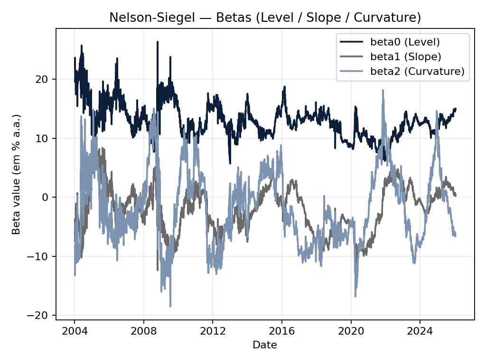

What it is useful for:

- Tracking structural shifts in the DI curve
- Identifying high-volatility periods in the factors
- Comparing the persistence of level vs. slope vs. curvature

### 5.2 Fitted curves on key dates

This chart compares the fitted NS curve on selected key dates, along with the observed DI tenors used in the fit.

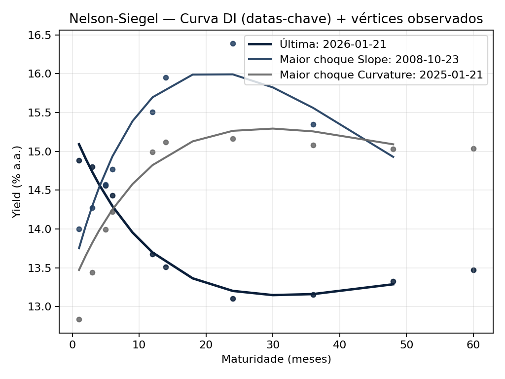

What it is useful for:

- Checking whether the fitted curve respects the observed points
- Understanding how the shape of the DI curve changes over time
- Visualizing steepening, flattening, or curvature shocks

### 5.3 Fit quality through time

This chart focuses on daily fit quality through the RMSE series.

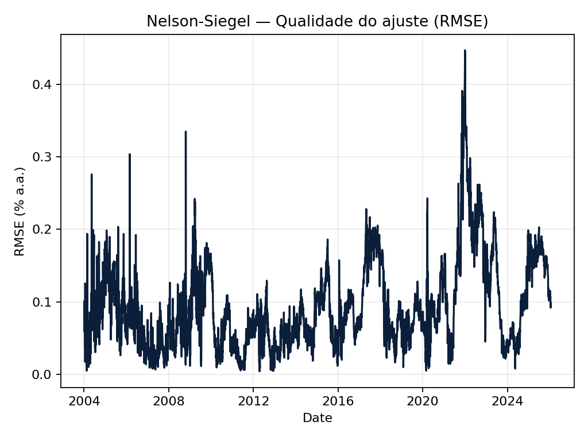

What it is useful for:

- Detecting unstable fit periods
- Identifying days with weaker cross-sectional adherence
- Monitoring model robustness across the sample

---

## 6. Step 4: Optional CDS Decomposition

The project can extend the NS fit with a CDS factor interpretation layer.

This logic is implemented in:

- `data.decompor_cds(...)`
- `modeling.fit_ns_with_cds_decomposition(...)`

### 6.1 What happens in CDS decomposition

The model estimates:

$$
\Delta CDS_t = \alpha + \gamma_1 \Delta DXY_t + \gamma_2 \Delta CRB_t + \gamma_3 \Delta VIX_t + \gamma_4 \Delta UST10_t + \epsilon_t
$$

Then it defines:

- `CDS_glob`: fitted value, interpreted as the global CDS component
- `CDS_dom`: residual, interpreted as the domestic CDS component

### 6.2 Why this matters

This allows the project to ask a more structural question:

- How much of the movement in the NS factors is explained by domestic risk?
- How much is explained by global risk?

### 6.3 Rolling sensitivity analysis

When `fit_ns_with_cds_decomposition(...)` is used, the project also computes rolling regressions of changes in `beta0`, `beta1`, and `beta2` against changes in `CDS_dom` and `CDS_glob`.

This produces:

- `df_sensitivities`
- `df_risk_contrib`

These outputs quantify how each risk component contributes to curve movements over time.

---

## 7. Step 5: Optional Inflation PCA

The project can also transform Focus inflation expectations into a compact factor representation.

This is implemented in `data.PCA_IPCA(...)`.

### 7.1 Input transformation

Focus expectations arrive as calendar-year expectations such as:

- `IPCA year`
- `IPCA year_1`
- `IPCA year_2`
- `IPCA year_3`

The project converts them into fixed horizons:

- `IPCA_12m`
- `IPCA_24m`
- `IPCA_36m`

using time-weighted interpolation.

### 7.2 PCA output

The PCA stage then extracts principal components such as:

- `InflPC1`
- `InflPC2`

These summarize the inflation expectations curve in a lower-dimensional representation that is easier to use in downstream modeling.

### 7.3 Why it matters for the NS workflow

This stage is useful when the user wants to connect curve shape changes to macro expectations rather than relying only on observed rates.

---

## 8. Step 6: Run the Backtest

Backtesting is implemented in `src/yc/backtest.py` through the `Backtest` class.

The backtest is not a trading backtest. It is a fit-validation framework designed to evaluate how well the Nelson-Siegel curve reproduces observed DI data.

### 8.1 Inputs to the backtest

The `Backtest` object is initialized with:

- observed DI data: `df_di`
- estimated NS betas: `df_betas`
- fitted NS curve: `df_curve`
- fit maturities
- target maturities

### 8.2 Residual computation

The first step is to compute daily residuals:

$$
	ext{residual}_{t,m} = \text{observed}_{t,m} - \text{fitted}_{t,m}
$$

This is done only for maturities that exist in both the observed and fitted datasets.

### 8.3 Performance metrics

The project then aggregates residuals into:

- overall RMSE
- overall MAE
- RMSE by maturity
- MAE by maturity
- coverage by maturity
- beta stability statistics

These metrics quantify both fit quality and parameter stability.

---

## 9. Step 7: Backtest Charts and Saved Images

Backtest figures should be saved in:

- `reports/backtest`

The repository already contains core and advanced backtest charts.

### 9.1 Core backtest diagnostics

#### Betas and RMSE over time

This chart combines the beta evolution with the time series of fit quality.

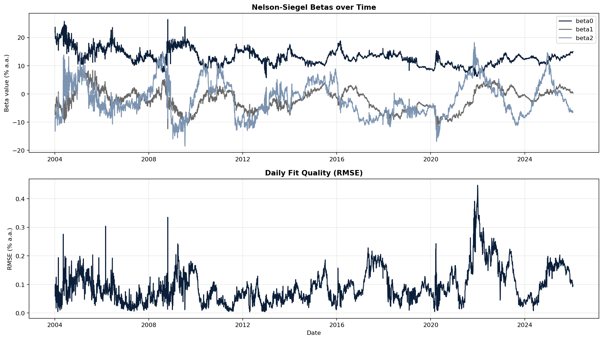

#### Residual distribution

This figure shows histograms of residuals by maturity.

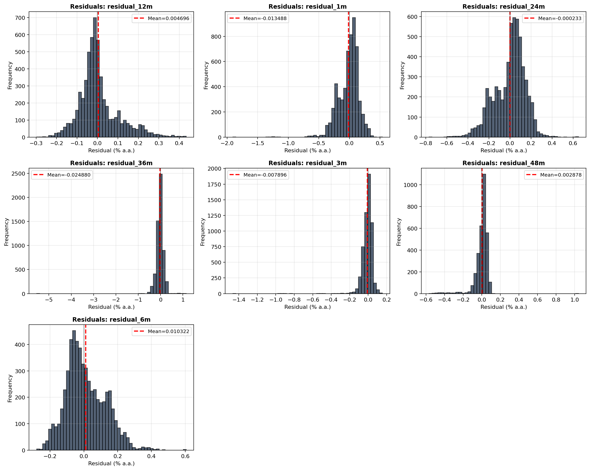

Why it matters:

- It reveals residual bias.
- It shows whether errors are tightly concentrated or widely dispersed.
- It highlights maturities with heavier tails.

#### Residuals through time

This chart shows the time path of residuals, maturity by maturity.

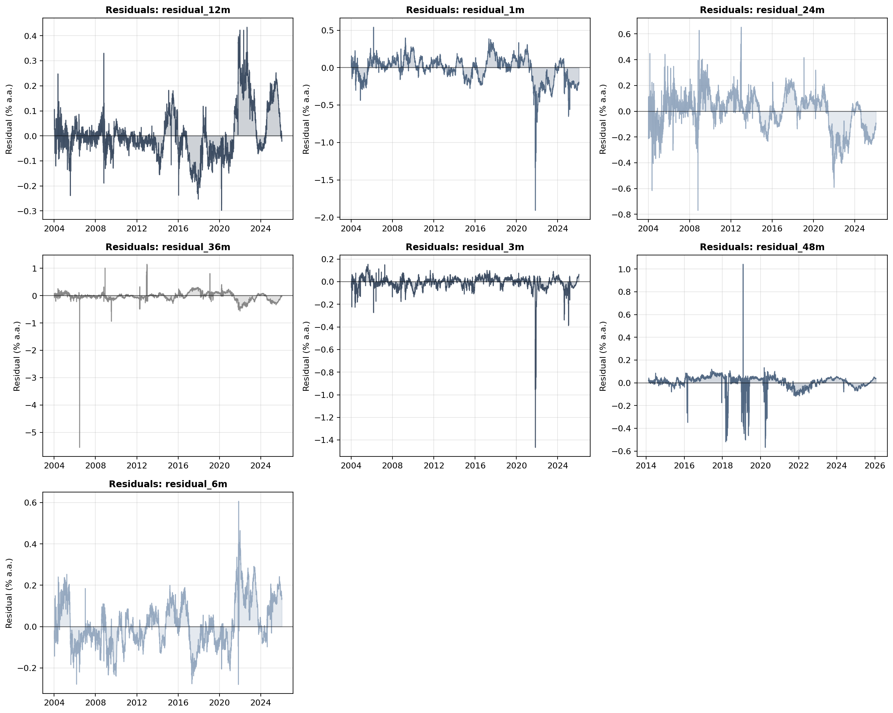

Why it matters:

- It helps detect clustering in model errors.
- It shows whether the model deteriorates in specific market periods.

#### RMSE by maturity

This bar chart summarizes where the model fits better and where it fits worse.

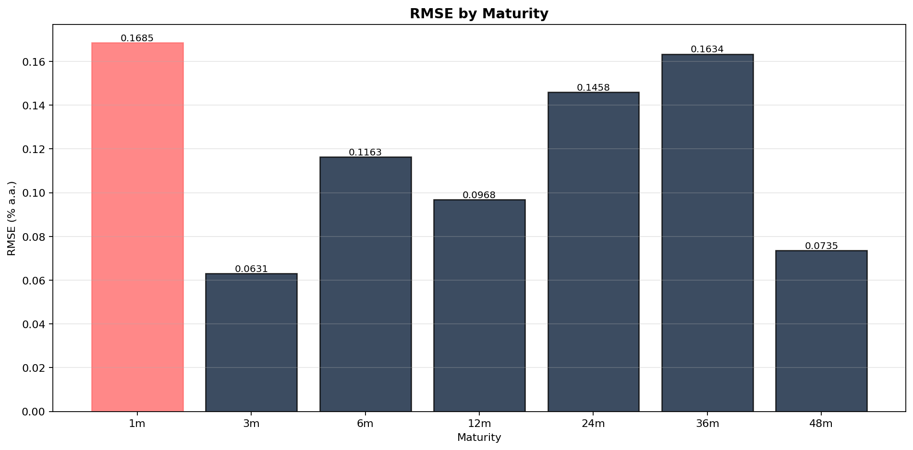

Why it matters:

- It shows which tenors are harder to fit.
- It makes maturity-specific weaknesses immediately visible.

### 9.2 Advanced backtest diagnostics

The repository also includes advanced analytical charts.

#### Rolling metrics

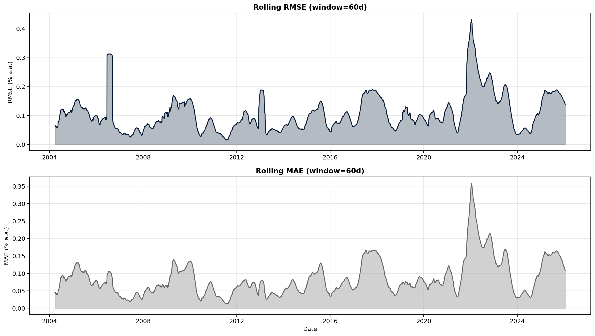

This is useful for monitoring whether fit quality changes across time windows rather than only in the full-sample aggregate.

#### Beta stability by period

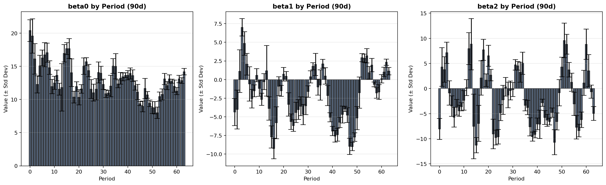

This helps identify whether specific subperiods exhibit more unstable factor dynamics.

#### CDS impact analysis

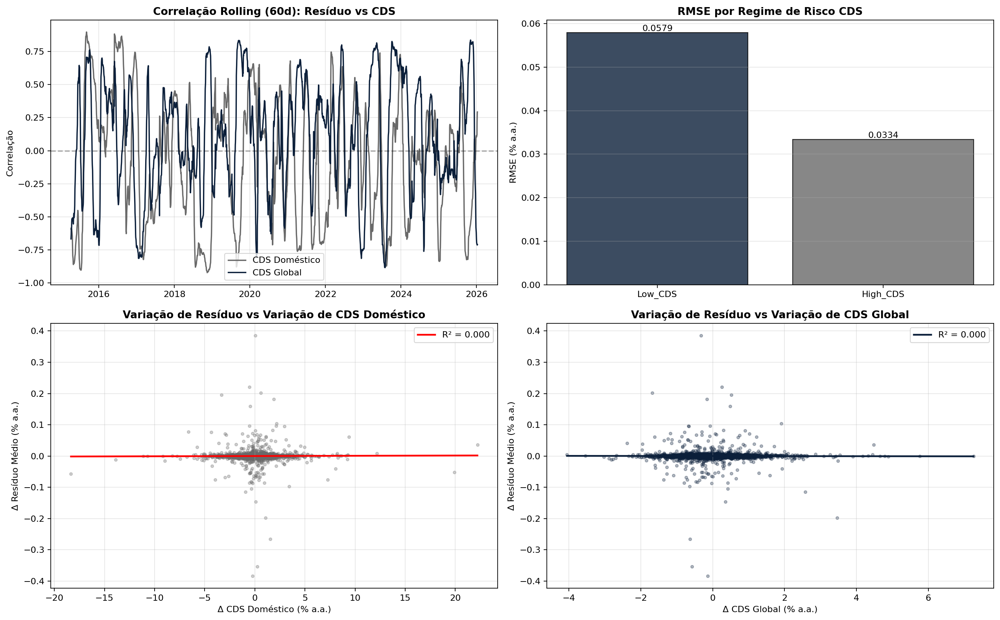

This chart is useful when the CDS-augmented framework is active and the user wants to interpret yield curve movements in risk-factor terms.

#### Regime comparison

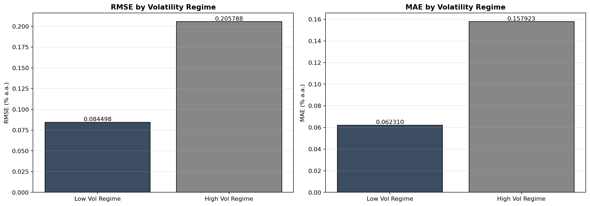

This is useful for comparing model behavior across different volatility environments.

#### Q-Q plots

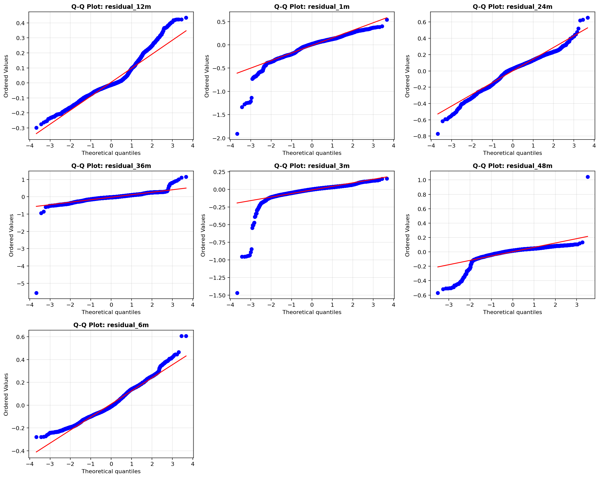

This helps assess whether residuals resemble a normal distribution or show heavy-tail behavior.

---

## 10. Step 8: Excel Outputs

The project exports structured Excel outputs alongside the charts.

### 10.1 NS export

The NS export includes sheets such as:

- daily betas
- fitted curve data
- summary diagnostics

### 10.2 Backtest export

The backtest export includes:

- `Summary`
- `By_Maturity`
- `Betas`
- `Residuals`

The main file currently stored in the backtest report folder is:

- `reports/backtest/backtest_report.xlsx`

The advanced analysis also exports:

- `reports/backtest/advanced_backtest_analysis.xlsx`

---

## 11. Validation and Tests

The automated validation currently lives mainly in:

- `src/tests/test_backtest.py`

This test file checks the following behaviors:

1. Backtest initialization works.
2. Residual computation returns non-empty output.
3. Performance metrics are computed correctly.
4. RMSE and MAE by maturity are valid.
5. Beta stability is computed.
6. Coverage calculations stay within valid bounds.
7. Plot generation creates PNG files successfully.
8. Excel export works.
9. Full backtest execution creates output files.
10. Advanced analysis methods return valid outputs.

In practical terms, this means the project already tests the generation of the same types of figures that are saved under `reports/backtest`.

### 11.1 What the tests are validating conceptually

The tests answer questions such as:

- Can the NS fit be turned into residuals consistently?
- Are the reported error metrics numerically coherent?
- Do the plotting methods save files successfully?
- Can the full reporting pipeline run end to end?

This makes the test suite a validation layer for both analytics and export logic.

---

## 12. End-to-End Operational Summary

If you run the pipeline end to end, the practical sequence is:

1. Load DI data.
2. Fit daily Nelson-Siegel curves.
3. Save beta and curve outputs.
4. Generate NS modeling figures in `reports/ns`.
5. Initialize the backtest using observed and fitted curves.
6. Compute residuals and metrics.
7. Generate validation figures in `reports/backtest`.
8. Export Excel summaries.
9. Optionally extend the analysis with CDS decomposition and inflation PCA.

The two key report folders should therefore remain organized as follows:

- `reports/ns`: NS modeling charts
- `reports/backtest`: backtest and validation charts

---

## 13. Recommended Folder Convention for Figures

To keep the workflow clean and reproducible, use this convention consistently:

### NS modeling figures

- `reports/ns/ns_betas_timeseries.png`
- `reports/ns/ns_curves_key_dates.png`
- `reports/ns/ns_fit_quality.png`

### Backtest figures

- `reports/backtest/backtest_betas_rmse.png`
- `reports/backtest/backtest_residuals_dist.png`
- `reports/backtest/backtest_residuals_ts.png`
- `reports/backtest/backtest_rmse_by_maturity.png`
- `reports/backtest/advanced_rolling_metrics.png`
- `reports/backtest/advanced_beta_stability_by_period.png`
- `reports/backtest/advanced_cds_impact.png`
- `reports/backtest/advanced_regime_comparison.png`
- `reports/backtest/advanced_qq_plots.png`

This is the convention already reflected by the current repository outputs, so the documentation and saved artifacts are aligned.

---

## 14. Bottom Line

This project is not just a static Nelson-Siegel fitter. It is a full workflow that:

- estimates the DI curve daily,
- tracks level, slope, and curvature through time,
- evaluates fit quality rigorously,
- exports operational diagnostics,
- supports richer macro interpretation with CDS decomposition and inflation PCA,
- and stores model and validation figures in a predictable reporting structure.

If you want this document to be extended further, the natural next additions are:

1. A section with exact commands to regenerate every figure.
2. A section mapping each image to the exact function that created it.
3. A section explaining how to interpret each beta economically in the Brazilian DI market.
